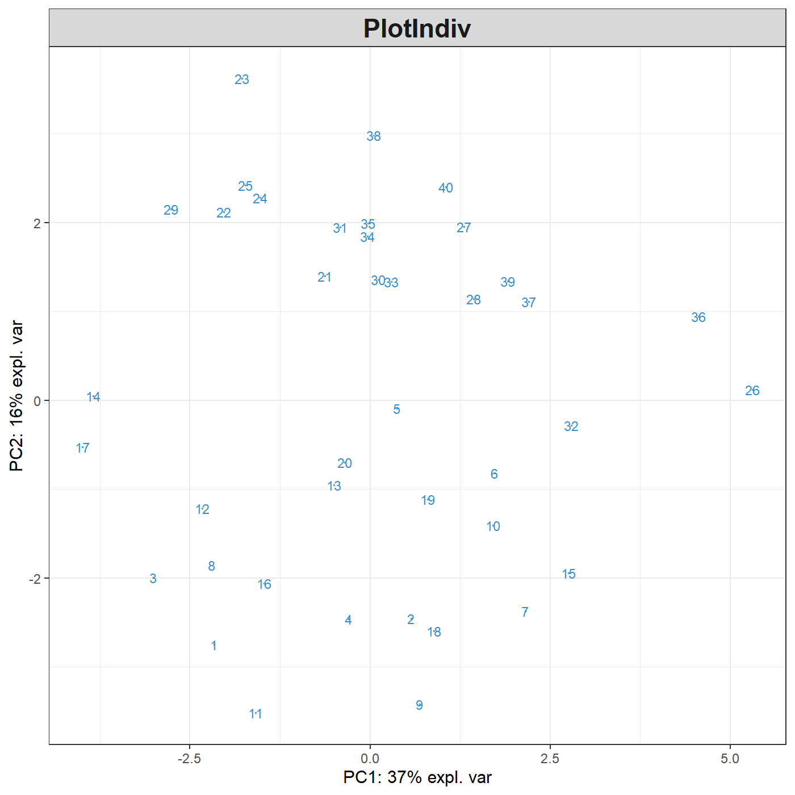

# Let's get started {#02}

## Installation {#02:install}

First, download the latest \texttt{mixOmics} version from Bioconductor:


```r
if (!requireNamespace("BiocManager", quietly = TRUE))
    install.packages("BiocManager")
 BiocManager::install("mixOmics")
```

Alternatively, you can install the latest GitHub version of the package:


```r
BiocManager::install("mixOmicsTeam/mixOmics")
```

The `mixOmics` package should directly import the following packages:
`igraph, rgl, ellipse, corpcor, RColorBrewer, plyr, parallel, dplyr, tidyr, reshape2, methods, matrixStats, rARPACK, gridExtra`.
**For Apple mac users:** if you are unable to install the imported package `rgl`, you will need to install the [XQuartz software](https://www.xquartz.org) first.

## Load the package {#02:load-data}


```r
library(mixOmics)
```

Check that there is no error when loading the package, especially for the `rgl` library (see above).

## Upload data
The examples we give in this vignette use data that are already part of the package. To upload your own data, check first that your working directory is set, then read your data from a  `.txt` or `.csv` format, either by using **File > Import Dataset** in RStudio or via one of these command lines:


```r
# from csv file
data <- read.csv("your_data.csv", row.names = 1, header = TRUE)

# from txt file
data <- read.table("your_data.txt", header = TRUE)
```

For more details about the arguments used to modify those functions, type `?read.csv` or `?read.table` in the R console.

## Quick start in `mixOmics` {#02:quick-start}

Each analysis should follow this workflow:

1. Run the method
2. Graphical representation of the samples
3. Graphical representation of the variables

Then use your critical thinking and additional functions and visual tools to make sense of your data! (some of which are listed in [1.2.2](#01:overview)) and will be described in the next Chapters.

For instance, for Principal Components Analysis, we first load the data:


```r
data(nutrimouse)
X <- nutrimouse$gene
```


Then use the following steps:


```r
MyResult.pca <- pca(X)  # 1 Run the method
plotIndiv(MyResult.pca) # 2 Plot the samples
```


```r
plotVar(MyResult.pca)   # 3 Plot the variables
```


This is only a first quick-start, there will be many avenues you can take to deepen your exploratory and integrative analyses. The package proposes several methods to perform variable, or feature selection to identify the relevant information from rather large omics data sets. The sparse methods are listed in the Table in [1.2.2](#01:overview).

Following our example here, sparse PCA can be applied to select the top 5 variables contributing to each of the two components in PCA. The user specifies the number of variables to selected on each component, for example, here 5 variables are selected on each of the first two components (`keepX=c(5,5)`): 


```r
MyResult.spca <- spca(X, keepX=c(5,5)) # 1 Run the method
plotIndiv(MyResult.spca)               # 2 Plot the samples
```



```r
plotVar(MyResult.spca)                 # 3 Plot the variables
```


You can see know that we have considerably reduced the number of genes in the `plotVar` correlation circle plot.


Do not stop here! We are not done yet. You can enhance your analyses with the following:

- Have a look at our manual and each of the functions and their examples, e.g. `?pca`, `?plotIndiv`, `?sPCA`, ... 

- Run the examples from the help file using the `example` function: `example(pca)`, `example(plotIndiv)`, ...

- Have a look at our [website](http://www.mixomics.org) that features many tutorials and case studies,

- Keep reading this vignette, this is *just the beginning!*

