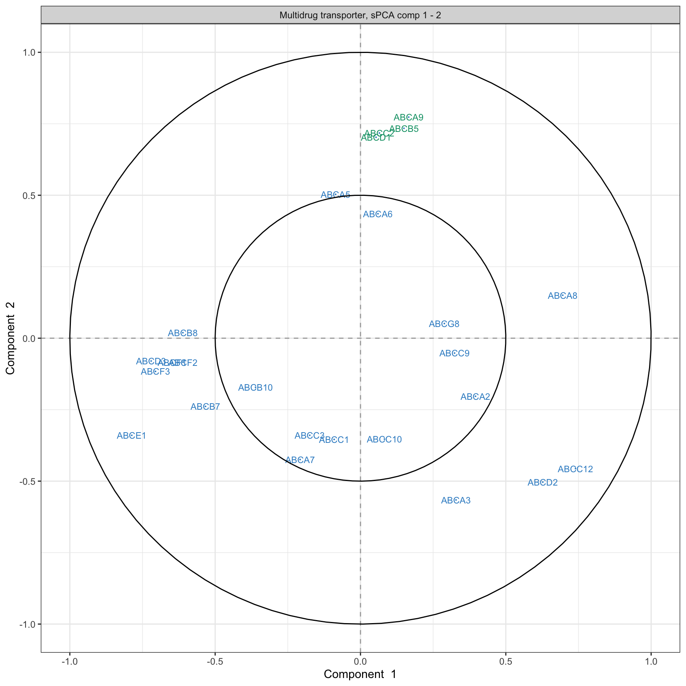

# PCA on the `multidrug` study {#03}

To illustrate PCA and is variants, we will analyse the `multidrug` case study available in the package. This pharmacogenomic study investigates the patterns of drug activity in cancer cell lines [@Sza04]. These cell lines come from the [NCI-60 Human Tumor Cell Lines](https://dtp.cancer.gov/discovery_development/nci-60/) established by the Developmental Therapeutics Program of the National Cancer Institute (NCI) to screen for the toxicity of chemical compound repositories in diverse cancer cell lines. NCI-60 includes cell lines derived from cancers of colorectal (7 cell lines), renal (8), ovarian (6), breast (8), prostate (2), lung (9) and central nervous system origin (6), as well as leukemia (6) and melanoma (8).

Two separate data sets (representing two types of measurements) on the same NCI-60 cancer cell lines are available in `multidrug` (see also `?multidrug`):

- `$ABC.trans`: Contains the expression of 48 human ABC transporters measured by quantitative real-time PCR (RT-PCR) for each cell line.

- `$compound`: Contains the activity of 1,429 drugs expressed as GI50, which is the drug concentration that induces 50\% inhibition of cellular growth for the tested cell line.

Additional information will also be used in the outputs:

- `$comp.name`: The names of the 1,429 compounds.

- `$cell.line`: Information on the cell line names (`$Sample`) and the  cell line types (`$Class`).

In this activity, we illustrate PCA performed on the human ABC transporters `ABC.trans`, and sparse PCA on the compound data `compound`. 

## Load the data {#03:load-data}

The input data matrix $\boldsymbol{X}$ is of size $N$ samples in rows and $P$ variables (e.g. genes) in columns. We start with the `ABC.trans` data.


```r
library(mixOmics)
data(multidrug)
X <- multidrug$ABC.trans
dim(X) # Check dimensions of data
```

```
## [1] 60 48
```


## Example: PCA {#03:pca}


### Choose the number of components {#03:pca-ncomp}

Contrary to the minimal code example, here we choose to also scale the variables for the reasons detailed earlier. The function `tune.pca()` calculates the cumulative proportion of explained variance for a large number of principal components (here we set `ncomp = 10`). A screeplot of the proportion of explained variance relative to the total amount of variance in the data for each principal component is output (Fig. \@ref(fig:03-screeplot)):


```r
tune.pca.multi <- tune.pca(X, ncomp = 10, scale = TRUE)
plot(tune.pca.multi)
```

<div class="figure" style="text-align: center">

<p class="caption">(\#fig:03-screeplot)(ref:03-screeplot)</p>
</div>

```r
# tune.pca.multidrug$cum.var       # Outputs cumulative proportion of variance
```

(ref:03-screeplot) **Screeplot from the PCA performed on the `ABC.trans` data**: Amount of explained variance for each principal component on the ABC transporter data.

From the numerical output (not shown here), we observe that the first two principal components explain 22.87% of the total variance, and the first three principal components explain 29.88% of the total variance. The rule of thumb for choosing the number of components is not so much to set a hard threshold based on the cumulative proportion of explained variance (as this is data-dependent), but to observe when a drop, or elbow, appears on the screeplot. The elbow indicates that the remaining variance is spread over many principal components and is not relevant in obtaining a low dimensional 'snapshot' of the data. This is an empirical way of choosing the number of principal components to retain in the analysis. In this specific example we could choose between 2 to 3 components for the final PCA, however these criteria are highly subjective and the reader must keep in mind that visualisation becomes difficult above three dimensions.

### PCA with fewer components {#03:pca-final}

Based on the preliminary analysis above, we run a PCA with three components. Here we show additional input, such as whether to center or scale the variables.


```r
final.pca.multi <- pca(X, ncomp = 3, center = TRUE, scale = TRUE)
# final.pca.multi  # Lists possible outputs
```

The output is similar to the tuning step above. Here the total variance in the data is:


```r
final.pca.multi$var.tot
```

```
## [1] 47.98305
```

By summing the variance explained from all possible components, we would achieve the same amount of explained variance. The proportion of explained variance per component is:


```r
final.pca.multi$prop_expl_var$X
```

```
##        PC1        PC2        PC3 
## 0.12677541 0.10194929 0.07011818
```

The cumulative proportion of variance explained can also be extracted (as displayed in Figure \@ref(fig:03-screeplot)):

```r
final.pca.multi$cum.var
```

```
##       PC1       PC2       PC3 
## 0.1267754 0.2287247 0.2988429
```

### Identify the informative variables {#03:pca-vars}

To calculate components, we use the variable coefficient weights indicated in the loading vectors. Therefore, the absolute value of the coefficients in the loading vectors inform us about the importance of each variable in contributing to the definition of each component. We can extract this information through the `selectVar()` function which ranks the most important variables in decreasing order according to their absolute loading weight value for each principal component. 


```r
# Top variables on the first component only:
head(selectVar(final.pca.multi, comp = 1)$value)
```

```
##        value.var
## ABCE1  0.3242162
## ABCD3  0.2647565
## ABCF3  0.2613074
## ABCA8 -0.2609394
## ABCB7  0.2493680
## ABCF1  0.2424253
```

Note: 

- *Here the variables are not selected (all are included), but ranked according to their importance in defining each component.*

### Sample plots {#03:pca-sample-plot}

We project the samples into the space spanned by the principal components to visualise how the samples cluster and assess for biological or technical variation in the data. We colour the samples according to the cell line information available in `multidrug$cell.line$Class` by specifying the argument `group` (Fig. \@ref(fig:03-pca-sample-plot)).


```r
plotIndiv(final.pca.multi,
          comp = c(1, 2),   # Specify components to plot
          ind.names = TRUE, # Show row names of samples
          group = multidrug$cell.line$Class,
          title = 'ABC transporters, PCA comp 1 - 2',
          legend = TRUE, legend.title = 'Cell line')
```

<div class="figure" style="text-align: center">

<p class="caption">(\#fig:03-pca-sample-plot)(ref:03-pca-sample-plot)</p>
</div>

(ref:03-pca-sample-plot) **Sample plot from the PCA performed on the `ABC.trans` data**. Samples are projected into the space spanned by the first two principal components, and coloured according to cell line type. Numbers indicate the rownames of the data.

Because we have run PCA on three components, we can examine the third component, either by plotting the samples onto the principal components 1 and 3 (PC1 and PC3) in the code above (`comp = c(1, 3)`) or by using the 3D interactive plot (code shown below). The addition of the third principal component only seems to highlight a potential outlier (sample 8, not shown). Potentially, this sample could be removed from the analysis, or, noted when doing further downstream analysis. The removal of outliers should be exercised with great caution and backed up with several other types of analyses (e.g. clustering) or graphical outputs (e.g. boxplots, heatmaps, etc).


```r
# Interactive 3D plot will load the rgl library.
plotIndiv(final.pca.multi, style = '3d',
           group = multidrug$cell.line$Class,
          title = 'ABC transporters, PCA comp 1 - 3')
```

These plots suggest that the largest source of variation explained by the first two components can be attributed to the <span style='color: #CC79A7;'>melanoma</span> cell line, while the third component highlights a single outlier sample. Hence, the interpretation of the following outputs should primarily focus on the first two components.

Note: 

- *Had we not scaled the data, the separation of the melanoma cell lines would have been more obvious with the addition of the third component, while PC1 and PC2 would have also highlighted the sample outliers 4 and 8. Thus, centering and scaling are important steps to take into account in PCA.*

### Variable plot: correlation circle plot {#03:pca-variable-plot}

Correlation circle plots indicate the contribution of each variable to each component using the `plotVar()` function, as well as the correlation between variables (indicated by a 'cluster' of variables). Note that to interpret the latter, the variables need to be centered and scaled in PCA:


```r
plotVar(final.pca.multi, comp = c(1, 2),
        var.names = TRUE,
        cex = 3,         # To change the font size
        # cutoff = 0.5,  # For further cutoff
        title = 'Multidrug transporter, PCA comp 1 - 2')
```

<div class="figure" style="text-align: center">

<p class="caption">(\#fig:03-pca-variable-plot)(ref:03-pca-variable-plot)</p>
</div>

(ref:03-pca-variable-plot) **Correlation Circle plot from the PCA performed on the `ABC.trans` data**. The plot shows groups of transporters that are highly correlated, and also contribute to PC1 - near the big circle on the right hand side of the plot (transporters grouped with those in <span style='color: #F68B33;'>orange</span>), or PC1 and PC2 - top left and top bottom corner of the plot, transporters grouped with those in <span style='color: #CC79A7;'>pink</span> and <span style='color: #999900;'>yellow</span>.

The plot in Figure \@ref(fig:03-pca-variable-plot) highlights a group of ABC transporters that contribute to PC1: <span style='color: #F68B33;'>ABCE1</span>, and to some extent the group clustered with <span style='color: #F68B33;'>ABCB8</span> that contributes positively to PC1, while <span style='color: #009E73;'>ABCA8</span> contributes negatively. We also observe a group of transporters that contribute to both PC1 and PC2: the group clustered with <span style='color: #CC79A7;'>ABCC2</span> contributes positively to PC2 and negatively to PC1, and a cluster of <span style='color: #999900;'>ABCC12</span> and <span style='color: #999900;'>ABCD2</span> that contributes negatively to both PC1 and PC2. We observe that several transporters are inside the small circle. However, examining the third component (argument `comp = c(1, 3)`) does not appear to reveal further transporters that contribute to this third component. The additional argument `cutoff = 0.5` could further simplify this plot.

### Biplot: samples and variables {#03:pca-biplot}

A biplot allows us to display both samples and variables simultaneously to further understand their relationships. Samples are displayed as dots while variables are displayed at the tips of the arrows. Similar to correlation circle plots, data must be centered and scaled to interpret the correlation between variables (as a cosine angle between variable arrows).


```r
biplot(final.pca.multi, group = multidrug$cell.line$Class, 
       legend.title = 'Cell line')
```

<div class="figure" style="text-align: center">

<p class="caption">(\#fig:03-pca-biplot)(ref:03-pca-biplot)</p>
</div>

(ref:03-pca-biplot) **Biplot from the PCA performed on the `ABS.trans` data**. The plot highlights which transporter expression levels may be related to specific cell lines, such as <span style='color: #CC79A7;'>melanoma</span>.

The biplot in Figure \@ref(fig:03-pca-biplot) shows that the <span style='color: #CC79A7;'>melanoma</span> cell lines seem to be characterised by a subset of transporters such as the cluster around <span style='color: #CC79A7;'>ABCC2</span> as highlighted previously  in Figure \@ref(fig:03-pca-variable-plot). Further examination of the data, such as boxplots (as shown in Fig. \@ref(fig:03-pca-boxplot)), can further elucidate the transporter expression levels for these specific samples.


```r
ABCC2.scale <- scale(X[, 'ABCC2'], center = TRUE, scale = TRUE)

boxplot(ABCC2.scale ~
        multidrug$cell.line$Class, col = color.mixo(1:9),
        xlab = 'Cell lines', ylab = 'Expression levels, scaled',
        par(cex.axis = 0.5), # Font size
        main = 'ABCC2 transporter')
```

<div class="figure" style="text-align: center">

<p class="caption">(\#fig:03-pca-boxplot)(ref:03-pca-boxplot)</p>
</div>

(ref:03-pca-boxplot) **Boxplots of the transporter <span style='color: #CC79A7;'>ABCC2</span>** identified from the PCA correlation circle plot (Fig. \@ref(fig:03-pca-variable-plot)) and the biplot (Fig. \@ref(fig:03-pca-biplot)) show the level of <span style='color: #CC79A7;'>ABCC2</span> expression related to cell line types. The expression level of <span style='color: #CC79A7;'>ABCC2</span> was centered and scaled in the PCA, but similar patterns are also observed in the original data.  

## Example: sparse PCA {#03:spca}

In the `ABC.trans` data, there is only one missing value. Missing values can be handled by sPCA via the NIPALS algorithm . However, if the number of missing values is large, we recommend imputing them with NIPALS, as we describe in our website in www.mixOmics.org.

### Choose the number of variables to select {#03:spca-vars}

First, we must decide on the number of components to evaluate. The previous tuning step indicated that `ncomp = 3` was sufficient to explain most of the variation in the data, which is the value we choose in this example. We then set up a grid of `keepX` values to test, which can be thin or coarse depending on the total number of variables. We set up the grid to be thin at the start, and coarse as the number of variables increases. The `ABC.trans` data includes a sufficient number of samples to perform repeated 5-fold cross-validation to define the number of folds and repeats (leave-one-out CV is also possible if the number of samples $N$ is small by specifying `folds = ` $N$). The computation may take a while if you are not using parallelisation (see additional parameters in `tune.spca()`), here we use a small number of repeats for illustrative purposes. We then plot the output of the tuning function.


```r
grid.keepX <- c(seq(5, 30, 5))
# grid.keepX  # To see the grid

set.seed(30) # For reproducibility with this handbook, remove otherwise
tune.spca.result <- tune.spca(X, ncomp = 3, 
                              folds = 5, 
                              test.keepX = grid.keepX, nrepeat = 10) 

# Consider adding up to 50 repeats for more stable results
tune.spca.result$choice.keepX
```

```
## comp1 comp2 comp3 
##    25    30    30
```

```r
plot(tune.spca.result)
```

<div class="figure" style="text-align: center">

<p class="caption">(\#fig:03-spca-tuning)(ref:03-spca-tuning)</p>
</div>

(ref:03-spca-tuning) **Tuning the number of variables to select with sPCA on the `ABC.trans` data**. For a grid of number of variables to select indicated on the x-axis, the average correlation between predicted and actual components based on cross-validation is calculated and shown on the y-axis for each component. The optimal number of variables to select per component is assessed via one-sided $t-$tests and is indicated with a diamond. 

The tuning function outputs the averaged correlation between predicted and actual components per `keepX` value for each component. It indicates the optimal number of variables to select for which the averaged correlation is maximised on each component. Figure \@ref(fig:03-spca-tuning) shows that this is achieved when selecting 25 transporters on the first component, and 30 on the second. Given the drop in values in the averaged correlations for the third component, we decide to only retain two components. 

Note: 

- *If the tuning results suggest a large number of variables to select that is close to the total number of variables, we can arbitrarily choose a much smaller selection size.*

### Final sparse PCA {#03:spca-final}

Based on the tuning above, we perform the final sPCA where the number of variables to select on each component is specified with the argument `keepX`. Arbitrary values can also be input if you would like to skip the tuning step for more exploratory analyses:


```r
# By default center = TRUE, scale = TRUE
keepX.select <- tune.spca.result$choice.keepX[1:2]

final.spca.multi <- spca(X, ncomp = 2, keepX = keepX.select)

# Proportion of explained variance:
final.spca.multi$prop_expl_var$X
```

```
##       PC1       PC2 
## 0.1201529 0.1040587
```

 Overall when considering two components, we lose approximately 0.5 % of explained variance compared to a full PCA, but the aim of this analysis is to identify key transporters driving the variation in the data, as we show below.

### Sample and variable plots {#03:spca-plots}

We first examine the sPCA sample plot:


```r
plotIndiv(final.spca.multi,
          comp = c(1, 2),   # Specify components to plot
          ind.names = TRUE, # Show row names of samples
          group = multidrug$cell.line$Class,
          title = 'ABC transporters, sPCA comp 1 - 2',
          legend = TRUE, legend.title = 'Cell line')
```

<div class="figure" style="text-align: center">

<p class="caption">(\#fig:03-spca-sample-plot)(ref:03-spca-sample-plot)</p>
</div>

(ref:03-spca-sample-plot) **Sample plot from the sPCA performed on the `ABC.trans` data**. Samples are projected onto the space spanned by the first two sparse principal components that are calculated based on a subset of selected variables. Samples are coloured by cell line type and numbers indicate the sample IDs.

In Figure \@ref(fig:03-spca-sample-plot), component 2 in sPCA shows clearer separation of the <span style='color: #CC79A7;'>melanoma</span> samples compared to the full PCA. Component 1 is similar to the full PCA. Overall, this sample plot shows that little information is lost compared to a full PCA.


A biplot can also be plotted that only shows the selected transporters (Figure \@ref(fig:03-spca-biplot)):


```r
biplot(final.spca.multi, group = multidrug$cell.line$Class, 
       legend =FALSE)
```

<div class="figure" style="text-align: center">

<p class="caption">(\#fig:03-spca-biplot)(ref:03-spca-biplot)</p>
</div>

(ref:03-spca-biplot) **Biplot from the sPCA performed on the `ABS.trans` data after variable selection**. The plot highlights in more detail which transporter expression levels may be related to specific cell lines, such as melanoma, compared to a classical PCA.


The correlation circle plot highlights variables that contribute to component 1 and component 2 (Fig. \@ref(fig:03-spca-variable-plot)): 


```r
plotVar(final.spca.multi, comp = c(1, 2), var.names = TRUE, 
        cex = 3, # To change the font size 
        title = 'Multidrug transporter, sPCA comp 1 - 2')
```

<div class="figure" style="text-align: center">

<p class="caption">(\#fig:03-spca-variable-plot)(ref:03-spca-variable-plot)</p>
</div>

(ref:03-spca-variable-plot) **Correlation Circle plot from the sPCA performed on the `ABC.trans` data**. Only the transporters selected by the sPCA are shown on this plot. Transporters coloured in <span style='color: #009E73;'>green</span> are discussed in the text.

The transporters selected by sPCA are amongst the most important ones in PCA. Those coloured in green in  Figure \@ref(fig:03-pca-variable-plot) (<span style='color: #009E73;'>ABCA9, ABCB5, ABCC2</span> and <span style='color: #009E73;'>ABCD1</span>) show an example of variables that contribute positively to component 2, but with a larger weight than in PCA. Thus, they appear as a clearer cluster in the top part of the correlation circle plot compared to PCA. As shown in the biplot in Figure \@ref(fig:03-spca-biplot), they contribute in explaining the variation in the <span style='color: #CC79A7;'>melanoma</span> samples.


We can extract the variable names and their positive or negative contribution to a given component (here 2), using the `selectVar()` function:


```r
# On the first component, just a head
head(selectVar(final.spca.multi, comp = 2)$value)
```

```
##        value.var
## ABCA9  0.3744148
## ABCB5  0.3690872
## ABCC2  0.3639616
## ABCD1  0.3418706
## ABCD2 -0.2581438
## ABCA5  0.2536514
```

The loading weights can also be visualised with `plotLoading()`, where variables are ranked from the least important (top) to the most important (bottom) in Figure \@ref(fig:03-spca-loading-plot)). Here on component 2:


```r
plotLoadings(final.spca.multi, comp = 2)
```

<div class="figure" style="text-align: center">

<p class="caption">(\#fig:03-spca-loading-plot)(ref:03-spca-loading-plot)</p>
</div>

(ref:03-spca-loading-plot) **sPCA loading plot of the `ABS.trans` data for component 2**. Only the transporters selected by sPCA on component 2 are shown, and are ranked from least important (top) to most important. Bar length indicates the loading weight in PC2.


