# P-Integration {#07}


## MINT on the stem cell case study {#07:mint}

We integrate four transcriptomics studies of microarray stem cells (125 samples in total). The original data set from the Stemformatics database^[www.stemformatics.org] [@Well13] was reduced to fit into the package, and includes a randomly-chosen subset of the expression levels of 400 genes. The aim is to classify three types of human cells: human fibroblasts (Fib) and human induced Pluripotent Stem Cells (hiPSC & hESC). 

There is a biological hierarchy among the three cell types. On one hand, differences between pluripotent (hiPSC and hESC) and non-pluripotent cells (Fib) are well-characterised and are expected to contribute to the main biological variation. On the other hand, hiPSC are genetically reprogrammed to behave like hESC and both cell types are commonly assumed to be alike. However, differences have been reported in the literature (@Chi09, @New10). We illustrate the use of MINT to address sub-classification problems in a single analysis.

## Load the data {#07:load-data}

We first load the data from the package and set up the categorical outcome $\boldsymbol Y$ and the `study` membership:


```r
library(mixOmics)
data(stemcells)

# The combined data set X
X <- stemcells$gene
dim(X)
```

```
## [1] 125 400
```

```r
# The outcome vector Y:  
Y <- stemcells$celltype 
length(Y) 
```

```
## [1] 125
```

```r
summary(Y)
```

```
## Fibroblast       hESC      hiPSC 
##         30         37         58
```

We then store the vector indicating the sample membership of each independent study:


```r
study <- stemcells$study

# Number of samples per study:
summary(study)
```

```
##  1  2  3  4 
## 38 51 21 15
```

```r
# Experimental design
table(Y,study)
```

```
##             study
## Y             1  2  3  4
##   Fibroblast  6 18  3  3
##   hESC       20  3  8  6
##   hiPSC      12 30 10  6
```


## Example: MINT PLS-DA {#07:plsda}

We first perform a MINT PLS-DA with all variables included in the model and `ncomp = 5` components. The `perf()` function is used to estimate the performance of the model using LOGOCV, and to choose the optimal number of components for our final model (see Fig \@ref(fig:07-plsda-perf)).


```r
mint.plsda.stem <- mint.plsda(X = X, Y = Y, study = study, ncomp = 5)

set.seed(2543) # For reproducible results here, remove for your own analyses
perf.mint.plsda.stem <- perf(mint.plsda.stem) 

plot(perf.mint.plsda.stem)
```

<div class="figure" style="text-align: center">
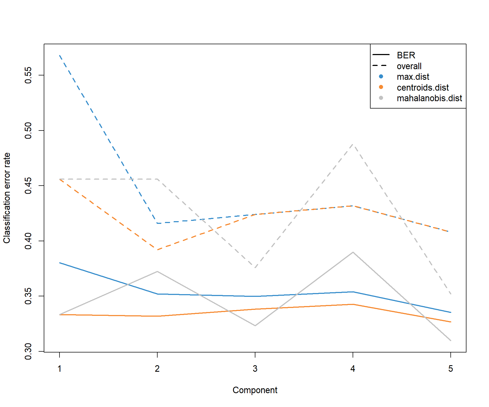
<p class="caption">(\#fig:07-plsda-perf)(ref:07-plsda-perf)</p>
</div>

(ref:07-plsda-perf) **Choosing the number of components in `mint.plsda` using `perf()` with LOGOCV in the `stemcells` study**. Classification error rates (overall and balanced, see Module 2) are represented on the y-axis with respect to the number of components on the x-axis for each prediction distance (see Module 3 and Extra Reading material 'PLS-DA appendix'). The plot shows that the error rate reaches a minimum from 1 component with the BER and centroids distance.


Based on the performance plot (Figure \@ref(fig:07-plsda-perf)), `ncomp = 2` seems to achieve the best performance for the centroid distance, and `ncomp = 1` for the Mahalanobis distance in terms of BER. Additional numerical outputs such as the BER and overall error rates per component, and the error rates per class and per prediction distance, can be output:


```r
perf.mint.plsda.stem$global.error$BER
# Type also:
# perf.mint.plsda.stem$global.error
```

```
##        max.dist centroids.dist mahalanobis.dist
## comp1 0.3803556      0.3333333        0.3333333
## comp2 0.3519556      0.3320000        0.3725111
## comp3 0.3499556      0.3384000        0.3232889
## comp4 0.3541111      0.3427778        0.3898000
## comp5 0.3353778      0.3268667        0.3097111
```


While we may want to focus our interpretation on the first component, we run a final MINT PLS-DA model for `ncomp = 2` to obtain 2D graphical outputs (Figure \@ref(fig:07-plsda-sample-plot1)):


```r
final.mint.plsda.stem <- mint.plsda(X = X, Y = Y, study = study, ncomp = 2)

#final.mint.plsda.stem # Lists the different functions

plotIndiv(final.mint.plsda.stem, legend = TRUE, title = 'MINT PLS-DA', 
          subtitle = 'stem cell study', ellipse = T)
```

<div class="figure" style="text-align: center">
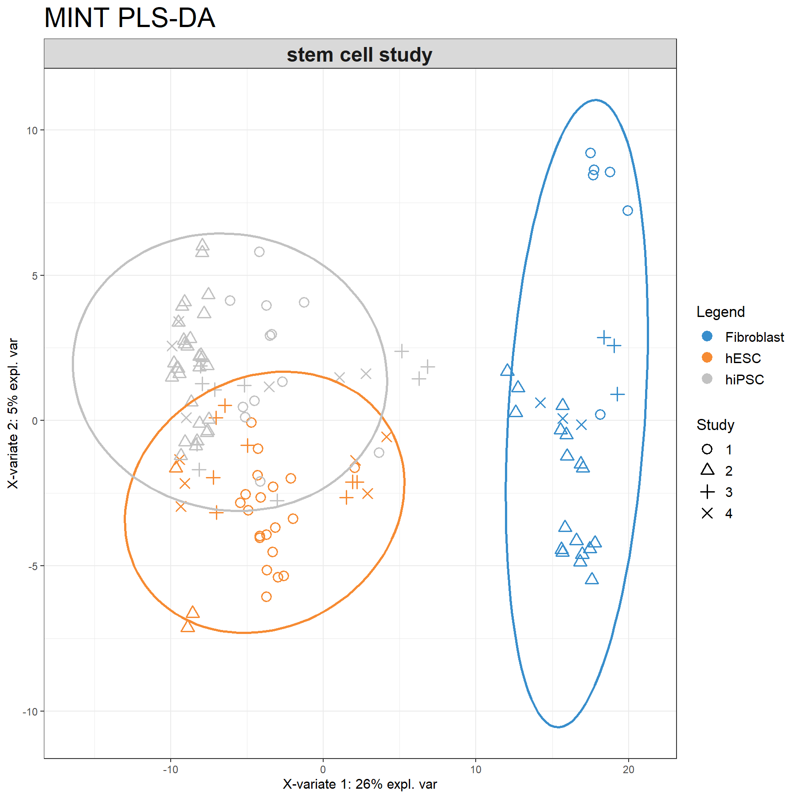
<p class="caption">(\#fig:07-plsda-sample-plot1)(ref:07-plsda-sample-plot1)</p>
</div>

(ref:07-plsda-sample-plot1)  **Sample plot from the MINT PLS-DA performed on the `stemcells` gene expression data**. Samples are projected into the space spanned by the first two components. Samples are coloured by their cell types and symbols indicate the study membership. Component 1 discriminates <span style='color: #388ECC;'>fibroblast</span> vs. the others, while component 2 discriminates some of the <span style='color: #585858;'>hiPSC</span> vs. <span style='color: #F68B33;'>hESC</span>.  

The sample plot (Fig \@ref(fig:07-plsda-sample-plot1)) shows that <span style='color: #388ECC;'>fibroblast</span> are separated on the first component. We observe that while deemed not crucial for an optimal discrimination, the second component seems to help separate <span style='color: #F68B33;'>hESC</span> and <span style='color: #585858;'>hiPSC</span> further. The effect of study after MINT modelling is not strong. 

We can compare this output to a classical PLS-DA to visualise the study effect (Figure \@ref(fig:07-plsda-sample-plot2)):


```r
plsda.stem <- plsda(X = X, Y = Y, ncomp = 2)

plotIndiv(plsda.stem, pch = study,
          legend = TRUE, title = 'Classic PLS-DA',
          legend.title = 'Cell type', legend.title.pch = 'Study')
```

<div class="figure" style="text-align: center">
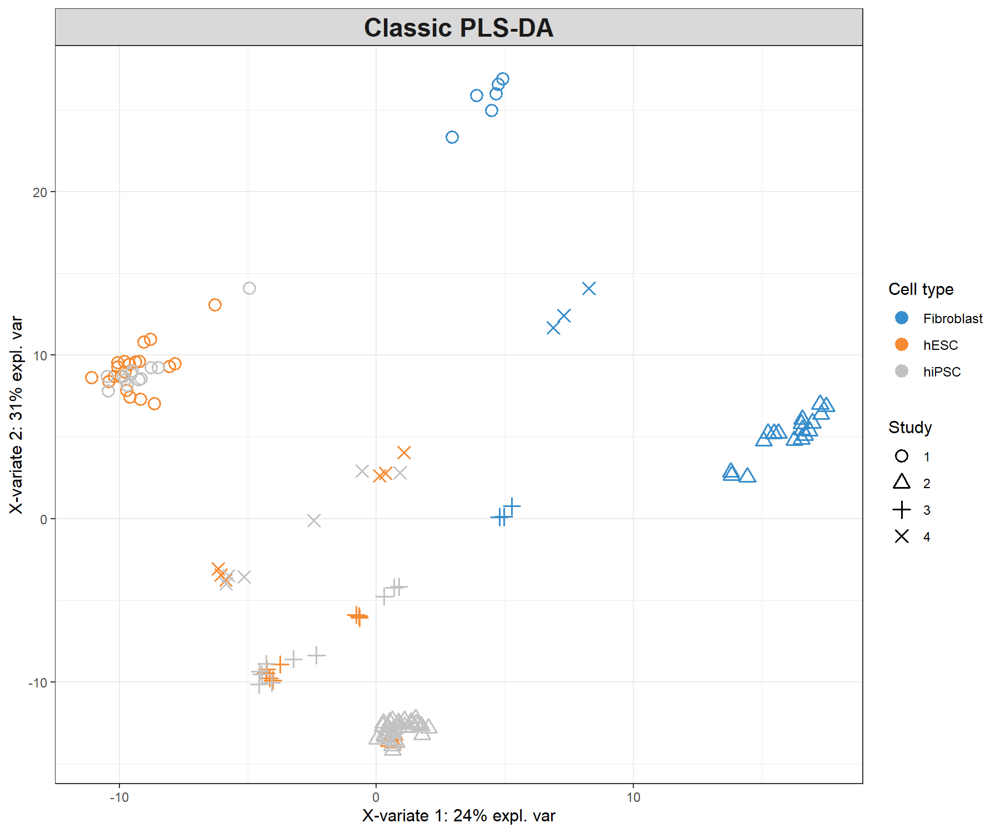
<p class="caption">(\#fig:07-plsda-sample-plot2)(ref:07-plsda-sample-plot2)</p>
</div>

(ref:07-plsda-sample-plot2)  **Sample plot from a classic PLS-DA performed on the `stemcells` gene expression data** that highlights the study effect (indicated by symbols). Samples are projected into the space spanned by the first two components. We still do observe some discrimination between the cell types. 


## Example: MINT sPLS-DA {#07:splsda}

The MINT PLS-DA model shown earlier is built on all 400 genes in $\boldsymbol X$, many of which may be uninformative to characterise the different classes. Here we aim to identify a small subset of genes that best discriminate the classes.

### Number of variables to select {#07:splsda-tuning}

We can choose the `keepX` parameter using the `tune()` function for a MINT object. The function performs LOGOCV for different values of `test.keepX` provided on each component, and no repeat argument is needed. Based on the mean classification error rate (overall error rate or BER) and a centroids distance, we output the optimal number of variables `keepX` to be included in the final model.


```r
set.seed(2543)  # For a reproducible result here, remove for your own analyses
tune.mint.splsda.stem <- tune(X = X, Y = Y, study = study, 
                 ncomp = 2, test.keepX = seq(1, 100, 1),
                 method = 'mint.splsda', #Specify the method
                 measure = 'BER',
                 dist = "centroids.dist",
                 nrepeat = 3)

#tune.mint.splsda.stem # Lists the different types of outputs

# Mean error rate per component and per tested keepX value:
#tune.mint.splsda.stem$error.rate[1:5,]
```


The optimal number of variables to select on each specified component:

```r
tune.mint.splsda.stem$choice.keepX
```

```
## comp1 comp2 
##    24     1
```


```r
plot(tune.mint.splsda.stem)
```

<div class="figure" style="text-align: center">
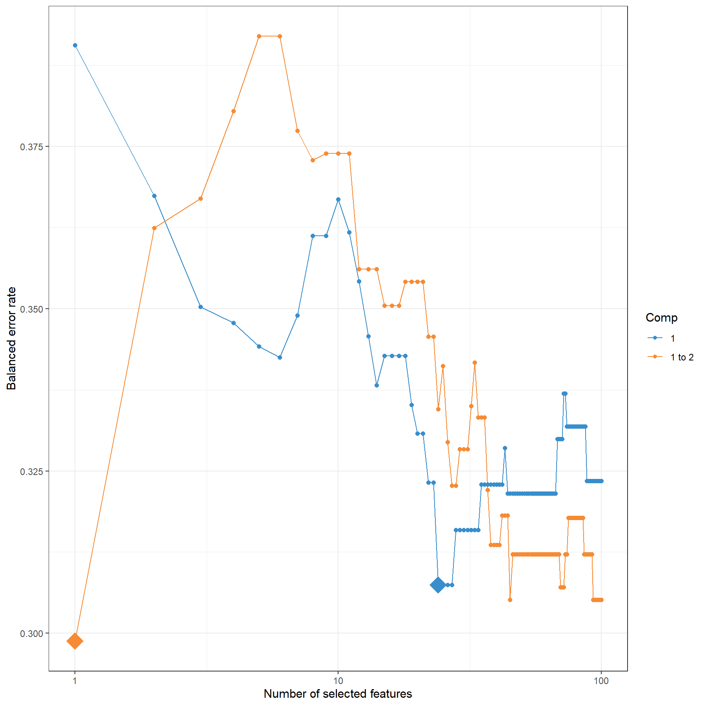
<p class="caption">(\#fig:07-splsda-tuning-plot)(ref:07-splsda-tuning-plot)</p>
</div>

(ref:07-splsda-tuning-plot) **Tuning `keepX` in MINT sPLS-DA performed on the `stemcells` gene expression data.** Each coloured line represents the balanced error rate (y-axis) per component across all tested `keepX` values (x-axis). The diamond indicates the optimal `keepX` value on a particular component which achieves the lowest classification error rate as determined with a one-sided $t-$test across the studies. 

The tuning plot in Figure \@ref(fig:07-splsda-tuning-plot) indicates the optimal number of variables to select on component 1 (24) and on component 2 (1). In fact, whilst the BER decreases with the addition of component 2, the standard deviation remains large, and thus only one component is optimal. However, the addition of this second component is useful for the graphical outputs, and also to attempt to discriminate the hESC and hiPCS cell types.

Note:

- *As shown in the quick start example, the tuning step can be omitted if you prefer to set arbitrary `keepX` values.*

### Final MINT sPLS-DA model {#07:splsda-final}

Following the tuning results, our final model is as follows (we still choose a model with two components in order to obtain 2D graphics):


```r
final.mint.splsda.stem <- mint.splsda(X = X, Y = Y, study = study, ncomp = 2,  
                              keepX = tune.mint.splsda.stem$choice.keepX)

#mint.splsda.stem.final # Lists useful functions that can be used with a MINT object
```


### Sample plots {#07:splsda-sample-plots}

The samples can be projected on the global components or alternatively using the partial components from each study (Fig \@ref(fig:07-splsda-sample-plots)). 


```r
plotIndiv(final.mint.splsda.stem, study = 'global', legend = TRUE, 
          title = 'Stem cells, MINT sPLS-DA', 
          subtitle = 'Global', ellipse = T)
```


```r
plotIndiv(final.mint.splsda.stem, study = 'all.partial', legend = TRUE, 
          title = 'Stem cells, MINT sPLS-DA', 
          subtitle = paste("Study",1:4))
```


<div class="figure" style="text-align: center">
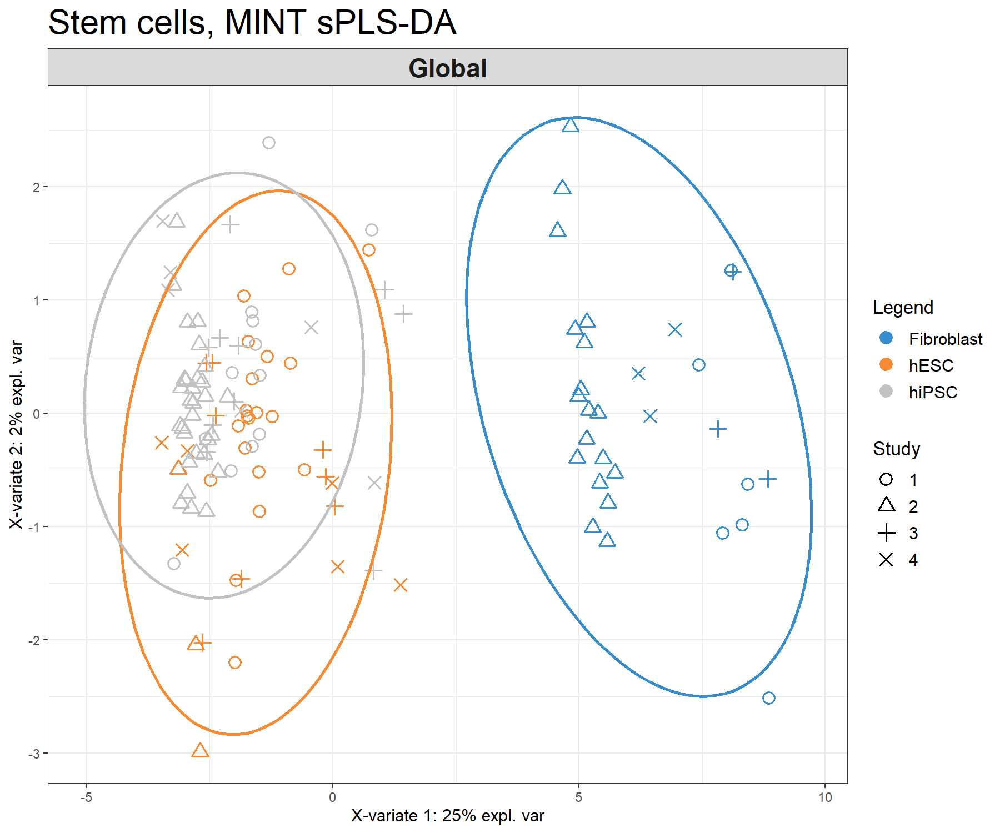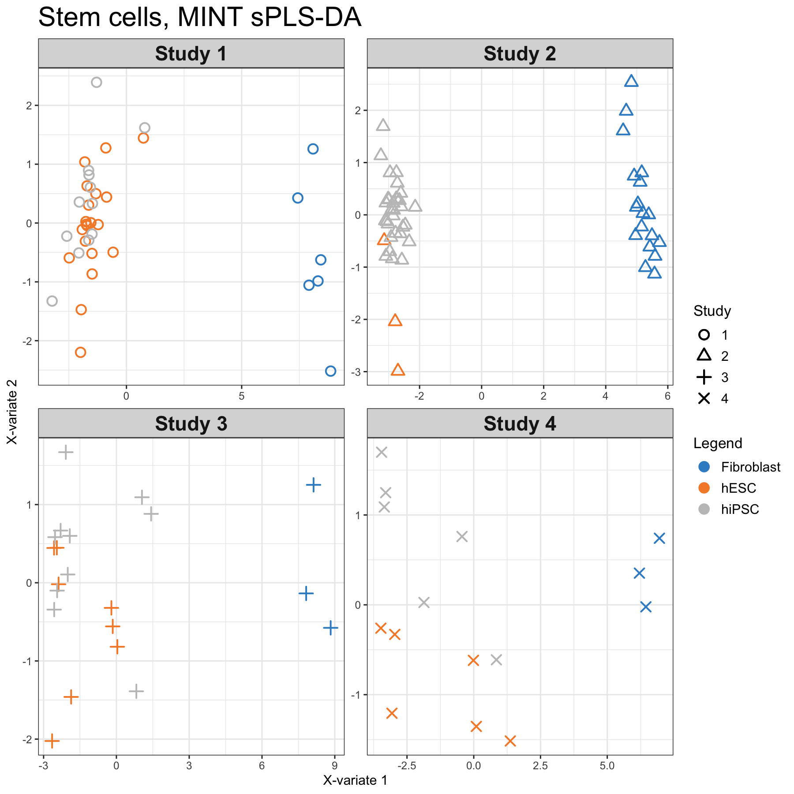
<p class="caption">(\#fig:07-splsda-sample-plots)(ref:07-splsda-sample-plots)</p>
</div>

(ref:07-splsda-sample-plots)  **Sample plots from the MINT sPLS-DA performed on the `stemcells` gene expression data**. Samples are projected into the space spanned by the first two components. Samples are coloured by their cell types and symbols indicate study membership.  (a) Global components from the model with 95\% ellipse confidence intervals around each sample class. (b) Partial components per study show a good agreement across studies.  Component 1 discriminates <span style='color: #388ECC;'>fibroblast</span> vs. the rest, component 2 discriminates further <span style='color: #F68B33;'>hESC</span> vs. <span style='color: #585858;'>hiPSC</span>. 

The visualisation of the partial components enables us to examine each study individually and check that the model is able to extract a good agreement between studies. 


### Variable plots {#07:splsda-variable-plots}


#### Correlation circle plot {#07:splsda-correlation-plot}

We can examine our molecular signature selected with MINT sPLS-DA. The correlation circle plot, presented in Module 2, highlights the contribution of each selected transcript to each component (close to the large circle), and their correlation (clusters of variables) in Figure \@ref(fig:07-splsda-correlation-plot2):


```r
plotVar(final.mint.splsda.stem)
```

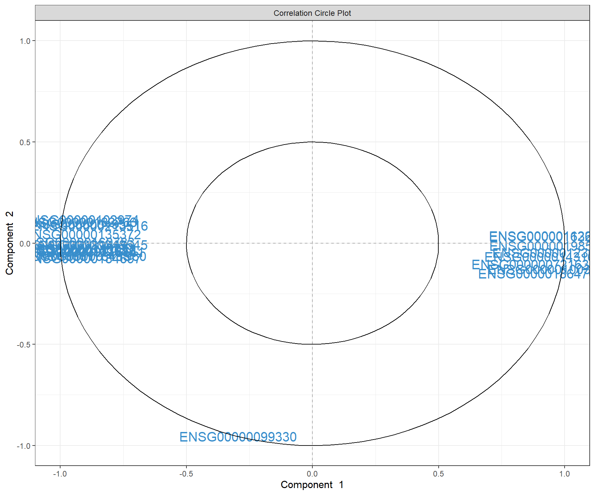

<!-- Code below to highlight specific genes -->

<div class="figure" style="text-align: center">
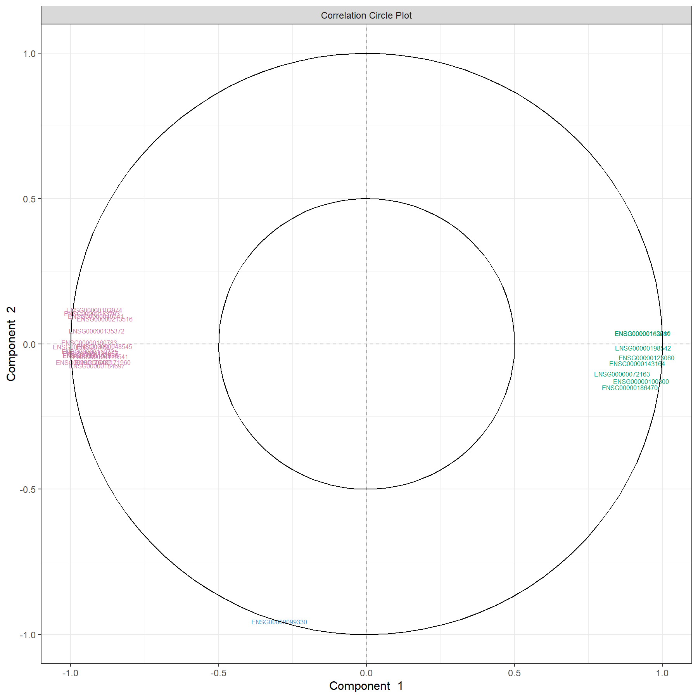
<p class="caption">(\#fig:07-splsda-correlation-plot2)(ref:07-splsda-correlation-plot2)</p>
</div>

(ref:07-splsda-correlation-plot2) **Correlation circle plot representing the genes selected by MINT sPLS-DA performed on the `stemcells` gene expression data** to examine the association of the genes selected on the first two components. We mainly observe two groups of genes, either <span style='color: #009E73;'>positively</span> or <span style='color: #CC79A7;'>negatively</span> associated with component 1 along the x-axis. This graphic should be interpreted in conjunction with the sample plot.


We observe a <span style='color: #CC79A7;'>subset of genes that are strongly correlated and negatively</span> associated to component 1 (negative values on the x-axis), which are likely to characterise the groups of samples hiPSC and hESC, and a <span style='color: #009E73;'>subset of genes positively</span> associated to component 1 that may characterise the fibroblast samples (and are negatively correlated to the previous group of genes). 

Note:

- *We can use the `var.name` argument to show gene name ID, as shown in Module 3 for PLS-DA.*

#### Clustered Image Maps {#07:splsda-cim}

The Clustered Image Map represents the expression levels of the gene signature per sample, similar to a PLS-DA object (see Module 3). Here we use the default Euclidean distance and Complete linkage in Figure \@ref(fig:07-splsda-cim) for a specific component (here 1): 


```r
# If facing margin issues, use either X11() or save the plot using the
# arguments save and name.save
cim(final.mint.splsda.stem, comp = 1, margins=c(10,5), 
    row.sideColors = color.mixo(as.numeric(Y)), row.names = FALSE,
    title = "MINT sPLS-DA, component 1")
```

<div class="figure" style="text-align: center">
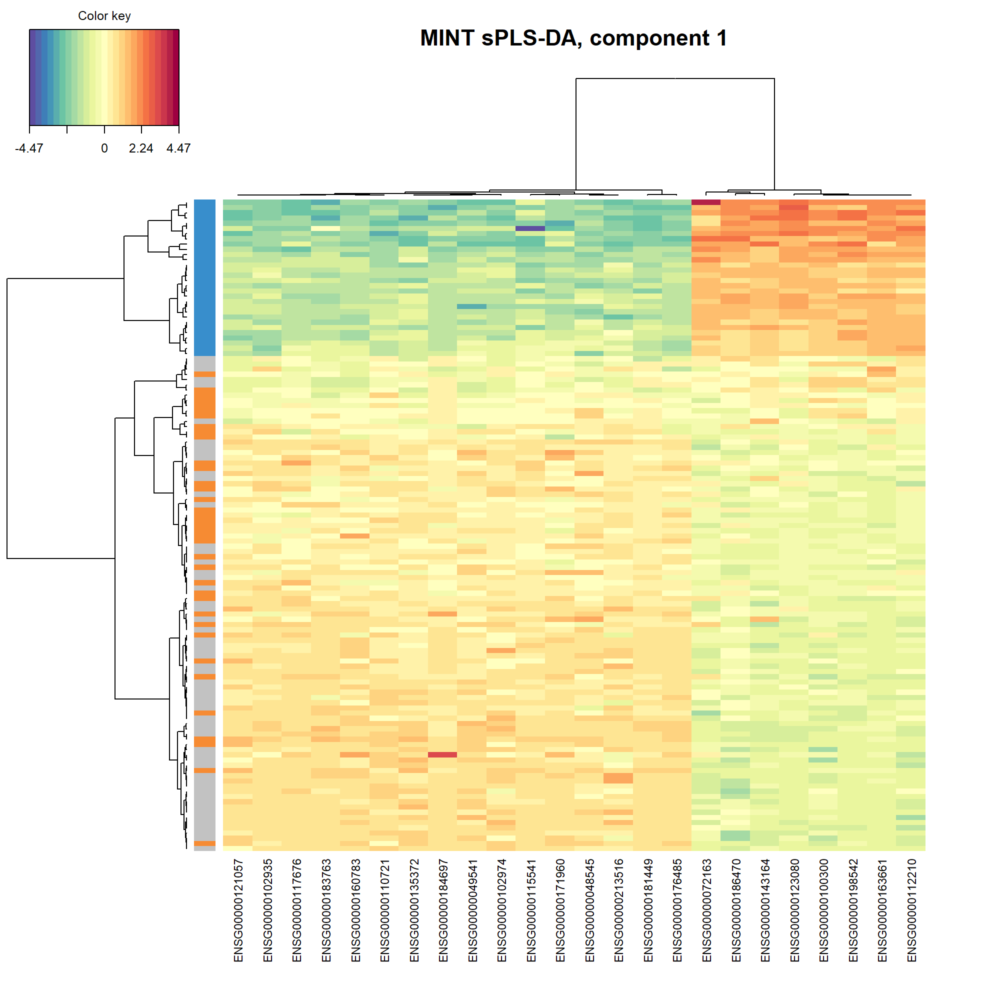
<p class="caption">(\#fig:07-splsda-cim)(ref:07-splsda-cim)</p>
</div>

(ref:07-splsda-cim) **Clustered Image Map of the genes selected by MINT sPLS-DA on the `stemcells` gene expression data for component 1 only**. A hierarchical clustering based on the gene expression levels of the selected genes on component 1, with samples in rows coloured according to cell type showing a separation of the <span style='color: #388ECC;'>fibroblast</span> vs. the other cell types.

As expected and observed from the sample plot Figure \@ref(fig:07-splsda-sample-plots), we observe in the CIM that the expression of the genes selected on component 1 discriminates primarily the <span style='color: #388ECC;'>fibroblast</span> vs. the other cell types.

#### Relevance networks {#07:splsda-network}

Relevance networks can also be plotted for a PLS-DA object, but would only show the association between the selected genes and the cell type (dummy variable in $\boldsymbol Y$ as an outcome category) as shown in Figure \@ref(fig:07-splsda-network). Only the variables selected on component 1 are shown (`comp = 1`): 


```r
# If facing margin issues, use either X11() or save the plot using the
# arguments save and name.save
network(final.mint.splsda.stem, comp = 1,
        color.node = c(color.mixo(1), color.mixo(2)), 
        shape.node = c("rectangle", "circle"))
```

<div class="figure" style="text-align: center">
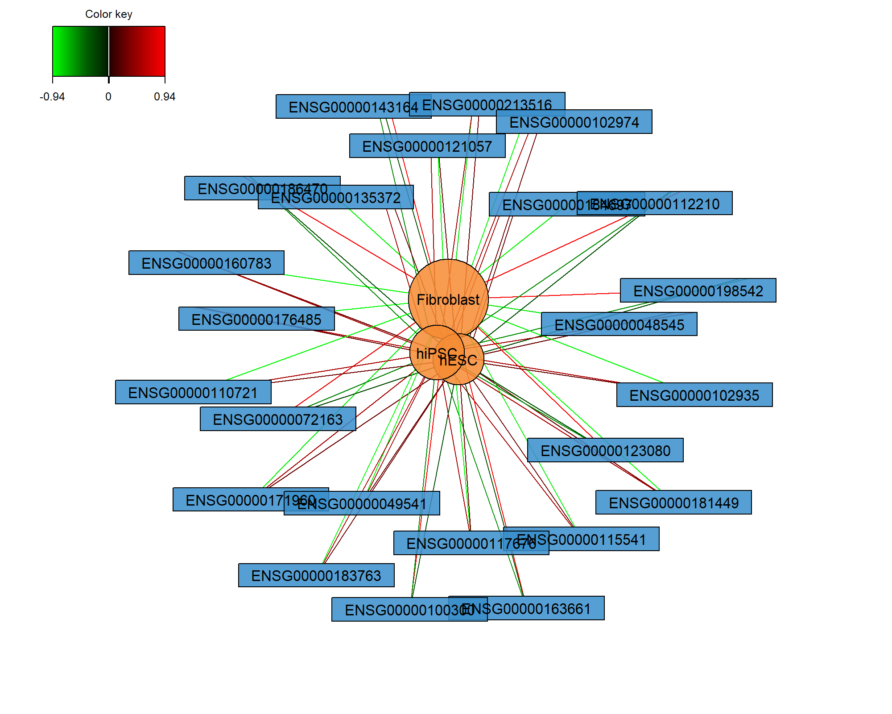
<p class="caption">(\#fig:07-splsda-network)(ref:07-splsda-network)</p>
</div>

(ref:07-splsda-network) **Relevance network of the genes selected by MINT sPLS-DA performed on the `stemcells` gene expression data for component 1 only**. Associations between variables from $\boldsymbol X$ and the dummy matrix $\boldsymbol Y$ are calculated as detailed in Extra Reading material from Module 2.  Edges indicate <span style='color: #CC0000;'>high</span> or <span style='color: #009E73;'>low</span> association between the genes and the different cell types. 


#### Variable selection and loading plots {#07:splsda-loading-plot}

The `selectVar()` function outputs the selected transcripts on the first component along with their loading weight values. We consider variables as important in the model when their absolute loading weight value is high. In addition to this output, we can compare the stability of the selected features across studies using the `perf()` function, as shown in PLS-DA in Module 3.


```r
# Just a head
head(selectVar(final.mint.plsda.stem, comp = 1)$value)
```

```
##                   value.var
## ENSG00000181449 -0.09764220
## ENSG00000123080  0.09606034
## ENSG00000110721 -0.09595070
## ENSG00000176485 -0.09457383
## ENSG00000184697 -0.09387322
## ENSG00000102935 -0.09370298
```

The `plotLoadings()` function displays the coefficient weight of each selected variable in each study and shows the agreement of the gene signature across studies (Figure \@ref(fig:07-splsda-loading-plot)). Colours indicate the class in which the mean expression value of each selected gene is maximal. For component 1, we obtain:


```r
plotLoadings(final.mint.splsda.stem, contrib = "max", method = 'mean', comp=1, 
             study="all.partial", title="Contribution on comp 1", 
             subtitle = paste("Study",1:4))
```

<div class="figure" style="text-align: center">
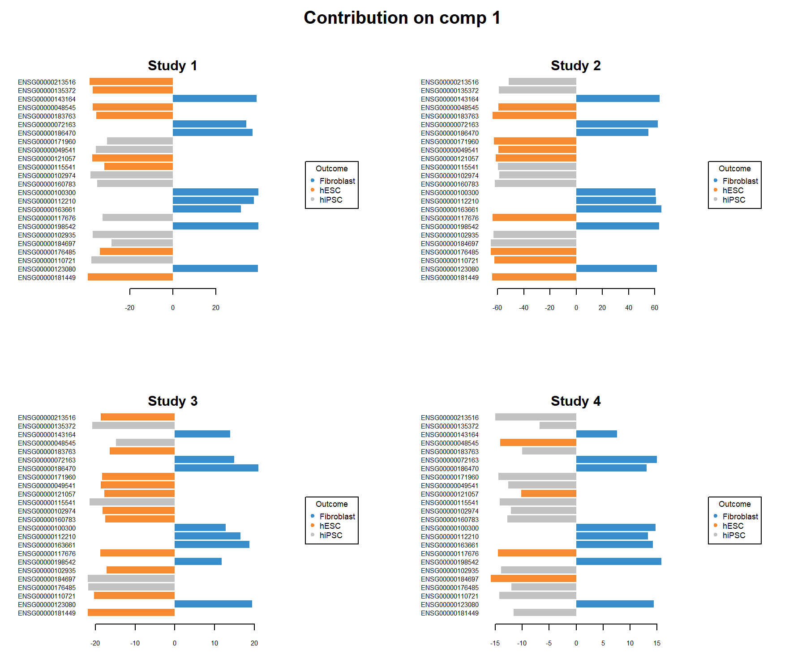
<p class="caption">(\#fig:07-splsda-loading-plot)(ref:07-splsda-loading-plot)</p>
</div>

(ref:07-splsda-loading-plot) **Loading plots of the genes selected by the MINT sPLS-DA performed on the `stemcells` data, on component 1 per study**. Each plot represents one study, and the variables are coloured according to the cell type they are maximally expressed in, on average. The length of the bars indicate the loading coefficient values that define the component. Several <span style='color: #388ECC;'>genes</span> distinguish between <span style='color: #388ECC;'>fibroblast</span> and the other cell types, and are consistently overexpressed in these samples across all studies. We observe slightly more variability in whether the expression levels of the other genes are more indicative of <span style='color: #585858;'>hiPSC</span> or <span style='color: #F68B33;'>hESC</span> cell types. 

Several <span style='color: #388ECC;'>genes</span> are consistently over-expressed on average in the <span style='color: #388ECC;'>fibroblast</span> samples in each of the studies, however, we observe a less consistent pattern for the other genes that characterise <span style='color: #585858;'>hiPSC</span>} and <span style='color: #F68B33;'>hESC</span>. This can be explained as the discrimination between both classes is challenging on component 1 (see sample plot in Figure \@ref(fig:07-splsda-sample-plots)).

### Classification performance {#07:splsda-perf}

We assess the performance of the MINT sPLS-DA model with the `perf()` function. Since the previous tuning was conducted with the distance `centroids.dist`, the same distance is used to assess the performance of the final model. We do not need to specify the argument `nrepeat` as we use LOGOCV in the function.


```r
set.seed(123)  # For reproducible results here, remove for your own study
perf.mint.splsda.stem.final <- perf(final.mint.plsda.stem, dist = 'centroids.dist')

perf.mint.splsda.stem.final$global.error
```

```
## $BER
##       centroids.dist
## comp1      0.3333333
## comp2      0.3320000
## 
## $overall
##       centroids.dist
## comp1          0.456
## comp2          0.392
## 
## $error.rate.class
## $error.rate.class$centroids.dist
##                comp1     comp2
## Fibroblast 0.0000000 0.0000000
## hESC       0.1891892 0.4594595
## hiPSC      0.8620690 0.5517241
```

The classification error rate per class is particularly insightful to understand which cell types are difficult to classify, hESC and hiPS -  whose mixture can be explained for biological reasons.

## Take a detour {#07:splsda-auroc}

### AUC
An AUC plot for the integrated data can be obtained using the function `auroc()` (Fig \@ref(fig:07-splsda-auroc-plots)). 

Remember that the AUC incorporates measures of sensitivity and specificity for every possible cut-off of the predicted dummy variables. However, our PLS-based models rely on prediction distances, which can be seen as a determined optimal cut-off. Therefore, the ROC and AUC criteria may not be particularly insightful in relation to the performance evaluation of our supervised multivariate methods, but can complement the statistical analysis (from @Roh17). 


```r
auroc(final.mint.splsda.stem, roc.comp = 1)
```

We can also obtain an AUC plot per study by specifying the argument `roc.study`:


```r
auroc(final.mint.splsda.stem, roc.comp = 1, roc.study = '2')
```


<div class="figure" style="text-align: center">
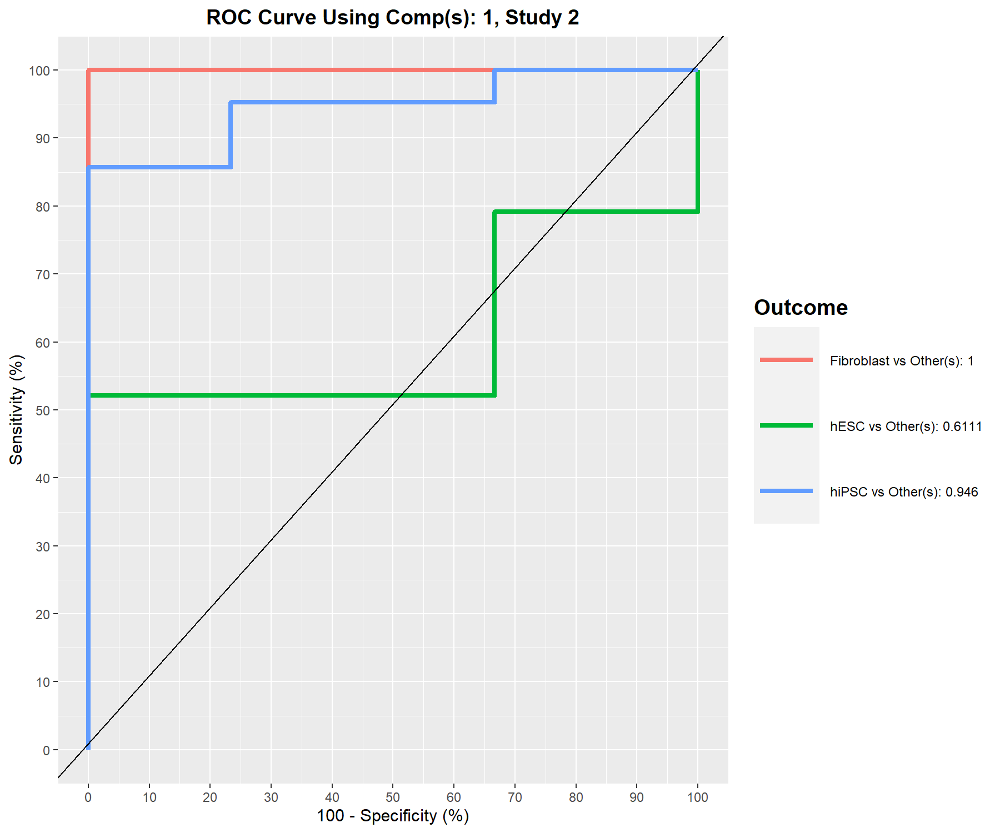
<p class="caption">(\#fig:07-splsda-auroc-plots)(ref:07-splsda-auroc-plots)</p>
</div>

(ref:07-splsda-auroc-plots) **ROC curve and AUC from the MINT sPLS-DA performed on the `stemcells` gene expression data for global and specific studies**, averaged across one-vs-all comparisons. Numerical outputs include the AUC and a Wilcoxon test $p-$value for each 'one vs. other' class comparison that are performed per component. This output complements the sPLS-DA performance evaluation but *should not be used for tuning* (as the prediction process in sPLS-DA is based on prediction distances, not a cutoff that maximises specificity and sensitivity as in ROC). The plot suggests that the selected features are more accurate in classifying <span style='color: #CC0000;'>fibroblasts versus the other cell types</span>, and less accurate in distinguishing <span style='color: #009E73;'>hESC versus the other cell types</span> or <span style='color: #388ECC;'>hiPSC versus the other cell types</span>.


### Prediction on an external study {#07:splsda-predict}

We use the  `predict()` function to predict the class membership of new test samples from an external study. We provide an example where we set aside a particular study, train the MINT model on the remaining three studies, then predict on the test study. This process exactly reflects the inner workings of the `tune()` and `perf()` functions using LOGOCV.

Here during our model training on the three studies only, we assume we have performed the tuning steps described in this case study to choose `ncomp` and `keepX` (here set to arbitrary values to avoid overfitting):


```r
# We predict on study 3
indiv.test <- which(study == "3")

# We train on the remaining studies, with pre-tuned parameters
mint.splsda.stem2 <- mint.splsda(X = X[-c(indiv.test), ], 
                                Y = Y[-c(indiv.test)], 
                                study = droplevels(study[-c(indiv.test)]), 
                                ncomp = 1,  
                                keepX = 30)

mint.predict.stem <- predict(mint.splsda.stem2, newdata = X[indiv.test, ], 
                        dist = "centroids.dist",
                        study.test = factor(study[indiv.test]))

# Store class prediction with a model with 1 comp
indiv.prediction <- mint.predict.stem$class$centroids.dist[, 1]

# The confusion matrix compares the real subtypes with the predicted subtypes
conf.mat <- get.confusion_matrix(truth = Y[indiv.test],
                     predicted = indiv.prediction)

conf.mat
```

```
##            predicted.as.Fibroblast predicted.as.hESC predicted.as.hiPSC
## Fibroblast                       3                 0                  0
## hESC                             0                 4                  4
## hiPSC                            2                 2                  6
```

Here we have considered a trained model with one component, and compared the cell type prediction for the test study 3 with the known cell types. The classification error rate is relatively high, but potentially could be improved with a proper tuning, and a larger number of studies in the training set.


```r
# Prediction error rate
(sum(conf.mat) - sum(diag(conf.mat)))/sum(conf.mat)
```

```
## [1] 0.3809524
```

