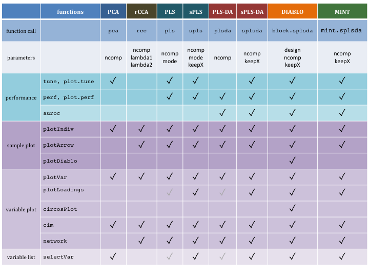

```{r 01-options, include=FALSE}
library(knitr)
# global options - probably better to put out.width='60%' for pdf output
knitr::opts_chunk$set(dpi = 100, echo=TRUE, warning=FALSE, message=FALSE, eval = TRUE, cache=FALSE,
                      fig.show=TRUE, fig.asp=1,fig.align='center', out.width = '75%',
                      fig.pos= "h", out.extra = '', fig.path= 'Figures/')

colorize <- function(color, x) {
  if (knitr::is_html_output()) {
    htmlcolor = "black"
    if(color == "blue"){
      htmlcolor = "#388ECC"
    }
    if(color == "orange"){
      htmlcolor = "#F68B33"
    }
    if(color == "grey"){
      htmlcolor = "#585858"
    }
    if(color == "green"){
      htmlcolor = "#009E73"
    }
    if(color == "pink"){
      htmlcolor = "#CC79A7"
    }
    if(color == "yellow"){
      htmlcolor = "#999900"
    }
    if(color == "darkred"){
      htmlcolor = "#CC0000"
    }
    sprintf("<span style='color: %s;'>%s</span>", htmlcolor, x)
  } else {
    sprintf("\\textcolor{%s}{%s}", color, x)
    }
}
```


# Introduction {#01}

`mixOmics` is an R toolkit dedicated to the exploration and integration of biological data sets with a specific focus on variable selection. The package currently includes more than twenty multivariate methodologies, mostly developed by the `mixOmics` team (see some of our references in [1.2.3](#01:pubs)). Originally, all methods were designed for omics data, however, their application is not limited to biological data only. Other applications where integration is required can be considered, but mostly for the case where the predictor variables are continuous (see also [1.1](#01:datatypes)). 

In `mixOmics`, a strong focus is given to graphical representation to better translate and understand the relationships between the different data types and visualize the correlation structure at both sample and variable levels.

## Input data {#01:datatypes}
Note the data pre-processing requirements before analysing data with `mixOmics`:

- **Types of data**. Different types of biological data can be explored and integrated with `mixOmics`. Our methods can handle molecular features measured on a continuous scale (e.g. microarray, mass spectrometry-based proteomics and metabolomics) or sequenced-based count data (RNA-seq, 16S, shotgun metagenomics) that become `continuous' data after pre-processing and normalisation. 


- **Normalisation**. The package does not handle normalisation as it is platform-specific and we cover a too wide variety of data! Prior to the analysis, we assume the data sets have been normalised using appropriate normalisation methods and pre-processed when applicable. 

- **Prefiltering**. While `mixOmics` methods can handle large data sets (several tens of thousands of predictors), we recommend pre-filtering the data to less than 10K predictor variables per data set, for example by using Median Absolute Deviation [@Ten16] for RNA-seq data, by removing consistently low counts in microbiome data sets [@Lec16] or by removing near-zero variance predictors. Such step aims to lessen the computational time during the parameter tuning process.

- **Data format**. 
Our methods use matrix decomposition techniques. Therefore, the numeric data matrix or data frames have $n$ observations or samples in rows and $p$ predictors or variables (e.g. genes, proteins, OTUs) in columns.

- **Covariates**. In the current version of `mixOmics`, covariates that may confound the analysis are not included in the methods. We recommend correcting for those covariates beforehand using appropriate univariate or multivariate methods for batch effect removal. Contact us for more details as we are currently working on this aspect.


## Methods

### Some background knowledge {#01:methods}

We list here the main methodological or theoretical concepts you need to know to be able to efficiently apply `mixOmics`:

- **Individuals, observations or samples**: the experimental units on which information are collected, e.g. patients, cell lines, cells, faecal samples etc.

- **Variables, predictors**: read-out measured on each sample, e.g. gene (expression), protein or OTU (abundance), weight etc. 

- **Variance**: measures the spread of one variable. In our methods, we estimate the variance of components rather that variable read-outs. A high variance indicates that the data points are very spread out from the mean, and from one another (scattered). 

- **Covariance**: measures the strength of the relationship between two variables, i.e. whether they co-vary. A high covariance value indicates a strong relationship, e.g. weight and height in individuals frequently vary roughly in the same way; roughly, the heaviest are the tallest. A covariance value has no lower or upper bound.

- **Correlation**: a standardized version of the covariance that is bounded by -1 and 1.

- **Linear combination**: variables are combined by multiplying each of them by a coefficient and adding the results. A linear combination of height and weight could be $2 * weight - 1.5 * height$ with the coefficients $2$ and $-1.5$ assigned with weight and height respectively.

- **Component**: an artificial variable built from a linear combination of the observed variables in a given data set. Variable coefficients are optimally defined based on some statistical criterion. For example in Principal Component Analysis, the coefficients of a (principal) component are defined so as to maximise the variance of the component.

- **Loadings**: variable coefficients used to define a component.

- **Sample plot**: representation of the samples projected in a small space spanned (defined) by the components. Samples coordinates are determined by their components values or scores. 

- **Correlation circle plot**: representation of the variables in a space spanned by the components. Each variable coordinate is defined as the correlation between the original variable value and each component. A correlation circle plot enables to visualise the correlation between variables - negative or positive correlation, defined by the cosine angle between the centre of the circle and each variable point) and the contribution of each variable to each component - defined by the absolute value of the coordinate on each component. For this interpretation, data need to be centred and scaled (by default in most of our methods except PCA). For more details on this insightful graphic, see Figure 1 in [@Gon12]. 

- **Unsupervised analysis**: the method does not take into account any known sample groups and the analysis is exploratory. Examples of unsupervised methods covered in this vignette are Principal Component Analysis (PCA, Chapter [3](#03)), Projection to Latent Structures (PLS, Chapter [4](#04)), and also Canonical Correlation Analysis (CCA, not covered here but see [the website page](http://mixomics.org/methods/rcca/)).

- **Supervised analysis**: the method includes a vector indicating the class membership of each sample. The aim is to discriminate sample groups and perform sample class prediction.  Examples of supervised methods covered in this vignette are PLS Discriminant Analysis (PLS-DA, Chapter [5](#05)), DIABLO (Chapter [6](#06)) and also MINT (Chapter [7](#07)).

If the above descriptions were not comprehensive enough and you have some more questions, feel free to explore the [glossary](http://mixomics.org/faq/glossary/) on our website.


### Overview {#01:overview}

Here is an overview of the most widely used methods in `mixOmics` that will be further detailed in this vignette, with the exception of rCCA. We depict them along with the type of data set they can handle. 


<p style="text-align: center">FIGURE 1: An overview of what quantity and type of dataset each method within mixOmics requires. Thin columns represent a single variable, while the larger blocks represent datasets of multiple samples and variables.</p>


```{r 01-methods-diagram, echo=FALSE, fig.cap="List of methods in mixOmics, sparse indicates methods that perform variable selection", out.width='100%', fig.align='center'}

```

```{r 01-cheatsheet, echo=FALSE, fig.cap="Main functions and parameters of each method", out.width= '100%', fig.align='center'}

```


### Key publications {#01:pubs}

The methods implemented in `mixOmics` are described in detail in the following publications. A more extensive list can be found at this [link](http://mixomics.org/a-propos/publications/).

- **Overview and recent integrative methods**: Rohart F.,  Gautier, B, Singh, A, Le Cao, K. A. mixOmics: an [R package for 'omics feature selection and multiple data integration](http://journals.plos.org/ploscompbiol/article?id=10.1371/journal.pcbi.1005752). *PLoS Comput Biol* 13(11): e1005752.

- **Graphical outputs for integrative methods**: [@Gon12] Gonzalez I., Le Cao K.-A., Davis, M.D. and Dejean S. (2012) [Insightful graphical outputs to explore relationships between two omics data sets](https://biodatamining.biomedcentral.com/articles/10.1186/1756-0381-5-19). *BioData Mining* 5:19.

- **DIABLO**: Singh A, Gautier B, Shannon C, Vacher M, Rohart F, Tebbutt S, K-A. Le Cao. [DIABLO - multi-omics data integration for biomarker discovery](https://www.biorxiv.org/content/early/2018/03/20/067611).

- **sparse PLS**: Le Cao K.-A., Martin P.G.P, Robert-Granie C. and Besse, P. (2009) [Sparse Canonical Methods for Biological Data Integration: application to a cross-platform study](http://www.biomedcentral.com/1471-2105/10/34/). *BMC Bioinformatics*, 10:34.

- **sparse PLS-DA**: Le Cao K.-A., Boitard S. and Besse P. (2011) [Sparse PLS Discriminant Analysis: biologically relevant feature selection and graphical displays for multiclass problems]( https://bmcbioinformatics.biomedcentral.com/articles/10.1186/1471-2105-12-253). *BMC Bioinformatics*, 22:253.

- **Multilevel approach for repeated measurements**: Liquet B, Le Cao K-A, Hocini H, Thiebaut R (2012). [A novel approach for biomarker selection and the integration of repeated measures experiments from two assays](https://bmcbioinformatics.biomedcentral.com/articles/10.1186/1471-2105-13-325). *BMC Bioinformatics*, 13:325

- **sPLS-DA for microbiome data**: Le Cao K-A$^*$, Costello ME $^*$, Lakis VA , Bartolo F, Chua XY, Brazeilles R and Rondeau P. (2016) [MixMC: Multivariate insights into Microbial Communities](http://journals.plos.org/plosone/article?id=10.1371/journal.pone.0160169).PLoS ONE 11(8): e0160169


## Outline of this Vignette {#01:outline}

- **[Chapter 2](#02)**: details some practical aspects to get started
- **[Chapter 3](#03)**: Principal Components Analysis (PCA)
- **[Chapter 4](#04)**: Projection to Latent Structures (PLS)
- **[Chapter 5](#05)**: Projection to Latent Structure - Discriminant Analysis (PLS-DA)
- **[Chapter 6](#06)**: Integrative analysis for multiple data sets, across samples (namely DIABLO)
- **[Chapter 7](#07)**: Integrative analysis for multiple data, across features (namely MINT)

Each methods chapter has the following outline:

1. Type of biological question to be answered
2. Brief description of an illustrative data set
3. Principle of the method
4. Quick start of the method with the main functions and arguments 
5. To go further: customized plots, additional graphical outputs, and tuning parameters
6. FAQ

## Other methods not covered in this vignette

Other methods not covered in this document are described on our website and the following references:

- [regularised Canonical Correlation Analysis](http://www.mixOmics.org), see the **Methods** and **Case study** tabs, and [@Gon08] that describes CCA for large data sets.

- [Microbiome (16S, shotgun metagenomics) data analysis](http://www.mixOmics.org/mixmc), see also [@Lec16] and [kernel integration for microbiome data](http://mixomics.org/mixkernel). The latter is in collaboration with Drs J Mariette and Nathalie Villa-Vialaneix (INRA Toulouse, France), an example is provided for the Tara ocean metagenomics and environmental data.


