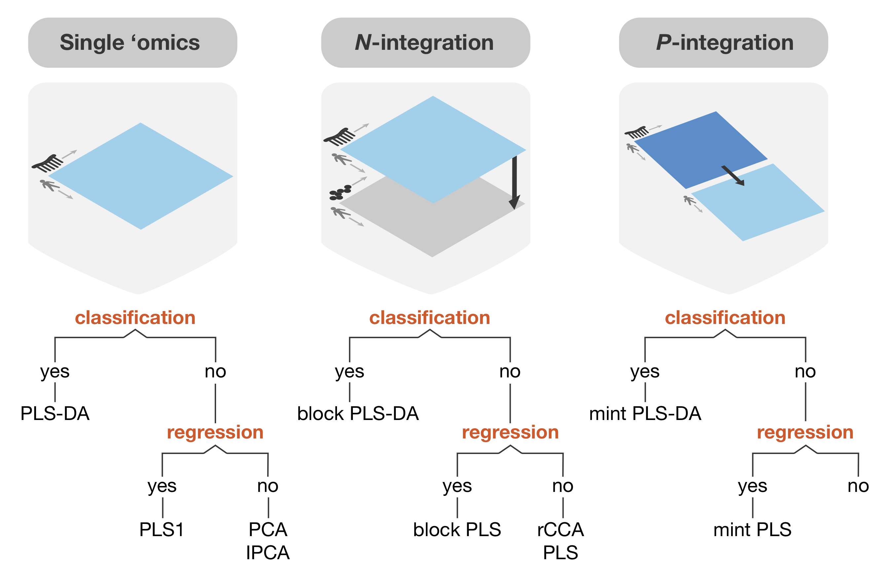

--- 
title: 'mixOmics vignette'
author:
- name: Kim-Anh Le Cao
  email: kimanh.lecao@unimelb.edu.au
  affiliation: Melbourne Integrative Genomics & School of Mathematics and Statistics, The University of Melbourne, Australia

package: mixOmics
date: '\today'
site: bookdown::bookdown_site
output: 
  bookdown::gitbook:
    split_bib: no
    includes:
     in_header: header.html
documentclass: book
bibliography: ["bibliography.bib"]
biblio-style: apalike
link-citations: true
github-repo: mixOmicsTeam/mixOmics
description: "Vignette for the R package mixOmics"
---

```{r 00-options, include=FALSE, eval=FALSE}
library(knitr)
# global options - probably better to put out.width='60%' for pdf output
knitr::opts_chunk$set(dpi = 100, echo=TRUE, warning=FALSE, message=FALSE, eval = TRUE, cache=FALSE,
                      fig.show=TRUE, fig.asp=1,fig.align='center', out.width = '75%',
                      fig.pos= "h", out.extra = '', fig.path= 'Figures/')
```

```{r 00-header-generation, echo=FALSE, eval=FALSE}
## run this only to re-make the logo in header.html
## Create the external file
img <- htmltools::img(src = knitr::image_uri("InputFigures/logo-mixomics.jpg"),
               alt = 'logo',
               style = 'position:absolute; top:25px; right:1%; padding:10px;z-index:200;')

htmlhead <- paste0('
<script>
document.write(\'<div class="logos">',img,'</div>\')
</script>
')

readr::write_lines(htmlhead, path = "header.html")
```


# Preamble {-}

If you are following our [online course](https://study.unimelb.edu.au/find/short-courses/mixomics-r-essentials-for-biological-data-integration/#course-specifics), the following vignette will be useful as a complementary learning tool. This vignette also covers the essential use cases of various methods in this package for the general `mixOmcis` user. The below methods will be covered:

- (s)PCA, 
- PLS1 and PLS2, 
- (s)PLS-DA,
- N-integration (multi-block sPLS-DA, aka. "DIABLO"), and 
- P-integration (multi-group sPLS-DA, aka "MINT").

As outlined in [1.3](#01:outline), this is not an exhaustive list of all the methods found within `mixOmics`. More information can be found at [our website](http://mixomics.org/) and you can ask questions via our [discourse forum](https://mixomics-users.discourse.group/).


```{r 00-analyses-diagram, eval=TRUE, echo=FALSE,fig.cap='**Different types of analyses with mixOmics** [@mixomics].The biological questions, the number of data sets to integrate, and the type of response variable, whether qualitative (classification), quantitative (regression), one (PLS1) or several (PLS) responses, all drive the choice of analytical method. All methods featured in this diagram include variable selection except rCCA. In N-integration, rCCA and PLS enable the integration of two quantitative data sets, whilst the block PLS methods (that derive from the methods from @Ten11) can integrate more than two data sets. In P-integration, our method MINT is based on multi-group PLS [@Esl14b].The following activities cover some of these methods.'}


```


